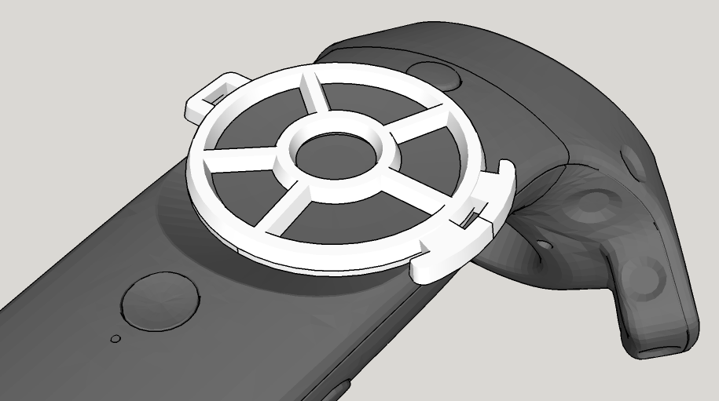
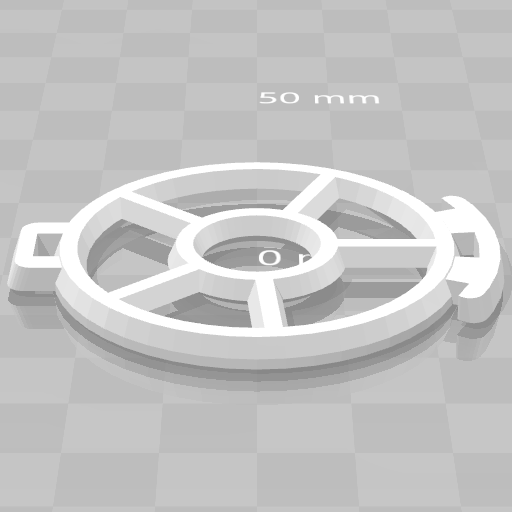
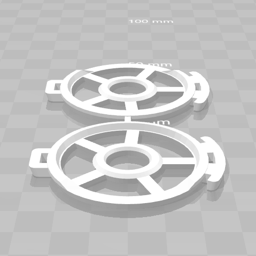

# vrchat-vive-touchpad-guide

A 3D-printable part that helps you to make hand gestures in VRChat.

## Models
* [ models/vrchat-vive-touchpad-guide.obj](models/vrchat-vive-touchpad-guide.obj): A guide frame for **left** hand.
* [ models/vrchat-vive-touchpad-guide-double.obj](models/vrchat-vive-touchpad-guide-double.obj): Guide frames for both left and right hands. You have to split them by hand.

## How to print this?
TBD

## How to use this in VRChat?
TBD
